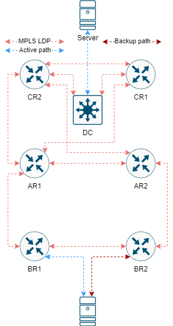
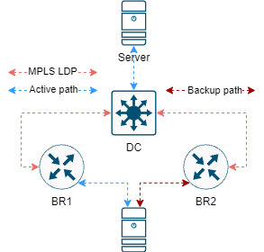

Huawei MPLS
===========

###############
Топология с IGP
###############

###########################
LDP прямые без лишних хопов
###########################

#########################################
Пример VPLS (точка-точка + active/backup)
#########################################

DC

::

    mpls ldp remote-peer 10.232.255.111
     remote-ip 10.232.255.111

    mpls ldp remote-peer 10.232.255.112
     remote-ip 10.232.255.112

    vsi 111
     pwsignal ldp
      vsi-id 111
      peer 10.232.255.111
      peer 10.232.255.112
      protect-group CITY
       protect-mode pw-redundancy master
       reroute delay 300
       peer 10.232.255.111 preference 5
       peer 10.232.255.112 preference 10
     encapsulation ethernet
     ignore-ac-state

     # Принимаем нетегированый трафик с порта сразу в VPLS
     interface GigabitEthernet0/0/1
      undo portswitch
      l2 binding vsi 111

     # Если мы хотим поймать какой-то тэгированный трафик с уже имеющегося порта или LAG
     interface Eth-Trunk5.111
      dot1q termination vid 111
      l2 binding vsi 111

BR1/BR2

::

    mpls ldp remote-peer 10.124.254.32
     remote-ip 10.124.254.32

    vsi 111
     pwsignal ldp
      vsi-id 111
      peer 10.124.254.32
     encapsulation ethernet
     ignore-ac-state

     interface Eth-Trunk33.111
      vlan-type dot1q 111
      mtu 1500
      l2 binding vsi 111

###############################################
Пример VPLS (точка-точка L2+L3 между железками)
###############################################

Если мы все же хотим натянуть виртуальный шнурок между двумя маршрутизаторами, то нам нужно использовать vsi в режиме bd-mode.

BR1 to CR1

::

    vsi 111 bd-mode
     pwsignal ldp
      vsi-id 111
      peer 10.138.255.111
     encapsulation ethernet
     ignore-ac-state

    bridge-domain 111
     l2 binding vsi 111

    interface Vbdif111
     ip address 10.10.90.90 255.255.255.0

CR1 to BR1

::

    vsi 111 bd-mode
     pwsignal ldp
      vsi-id 111
      peer 10.119.255.111
     encapsulation ethernet
     ignore-ac-state

    bridge-domain 111
     l2 binding vsi 111

    interface Vbdif111
     ip address 10.10.90.91 255.255.255.0
